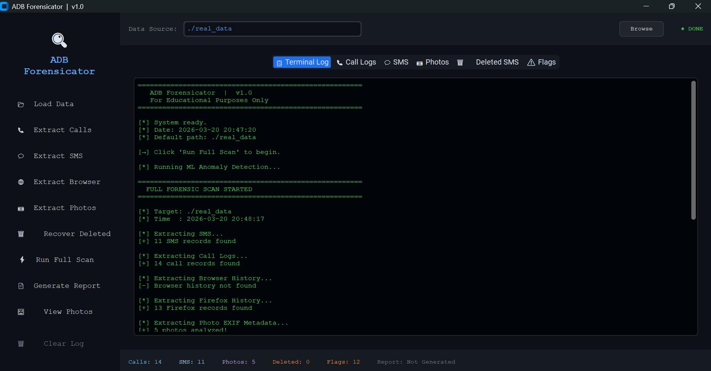
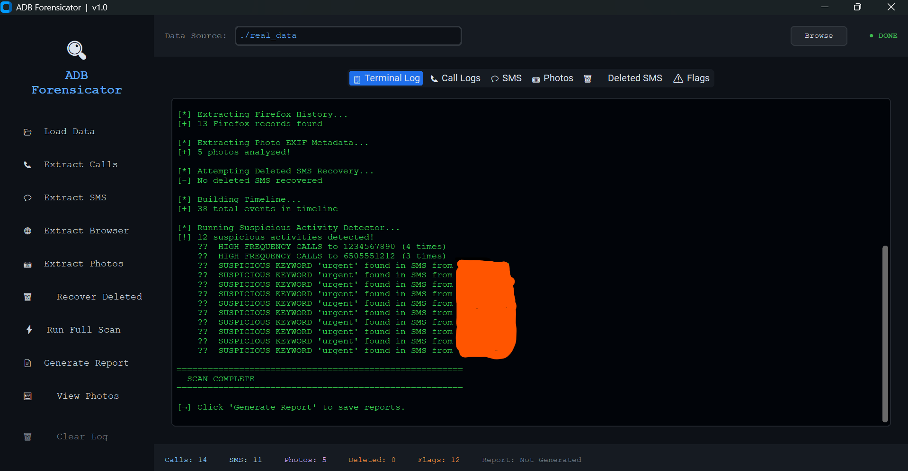
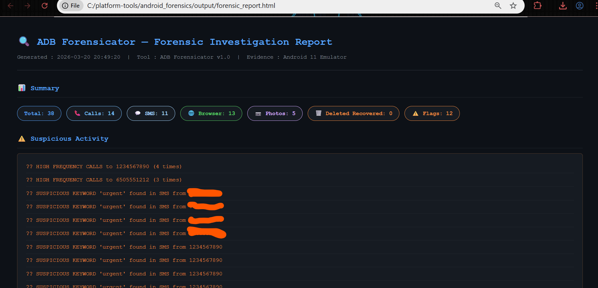
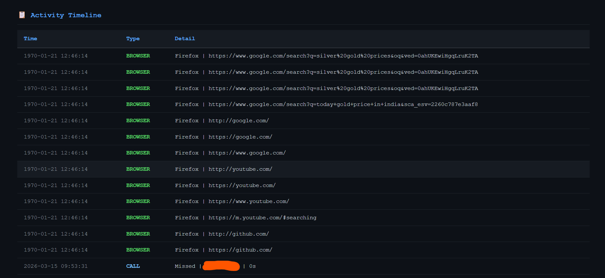
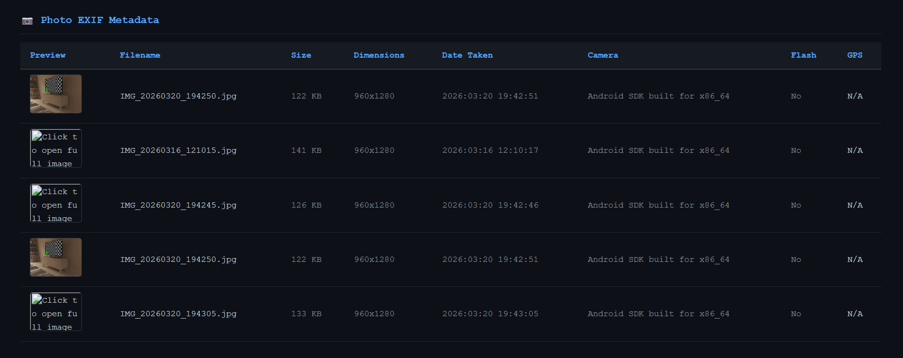
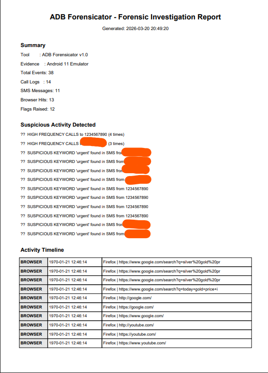

# 🔍 ADB Forensicator

An Android Digital Forensics tool built with Python
that extracts and analyzes artifacts from Android 
devices using ADB (Android Debug Bridge).


---

## 📸 Screenshots

### 🖥️ GUI - Terminal Log


### ✅ GUI - Scan Complete


### 🌐 HTML Report - Summary


### 📋 HTML Report - Timeline


### 📷 HTML Report - Photo EXIF


### 📄 PDF Report


---

## ✅ Features
- 📞 Call Log Extraction
- 💬 SMS Extraction
- 🌐 Firefox Browser History Analysis
- 📷 EXIF Photo Metadata Extraction
- 🗑️ Deleted SMS Recovery (SQLite Binary Forensics)
- 🤖 ML Anomaly Detection (Isolation Forest)
- ⚠️ Suspicious Activity Detection
- 📄 PDF + HTML Forensic Reports
- 🖥️ Professional Dark Themed GUI

---

## 🛠️ Tech Stack
| Tool | Purpose |
|---|---|
| Python 3.13 | Core language |
| ADB (Android Debug Bridge) | Device communication |
| SQLite3 | Database forensics |
| Scikit-learn | ML anomaly detection |
| Pandas | Data analysis |
| CustomTkinter | GUI framework |
| FPDF2 | PDF generation |
| Pillow + ExifRead | Photo metadata |
| Android Studio | Emulator environment |
| Firefox APK | Browser history source |

---

## ⚙️ Installation

### Step 1 — Install Python
1. Go to https://python.org/downloads
2. Download Python 3.10+
3. Check "Add Python to PATH" during install
4. Verify:
```
python --version
```

### Step 2 — Install ADB
1. Download Platform Tools from:
   https://developer.android.com/tools/releases/platform-tools
2. Extract to `C:\platform-tools\`
3. Add `C:\platform-tools\` to System PATH
4. Verify:
```
adb version
```

### Step 3 — Install Python Libraries
```
pip install pandas fpdf2 customtkinter pillow exifread scikit-learn numpy
```

### Step 4 — Install Android Studio
1. Download from https://developer.android.com/studio
2. Install and open Android Studio
3. Go to Device Manager
4. Click Create Device
5. Select Pixel 4
6. Select API 30 (Android 11) AOSP image
7. Click Finish and launch emulator

### Step 5 — Install Firefox on Emulator
1. Download Firefox x86_64 APK from:
   https://www.apkmirror.com/apk/mozilla/firefox/
2. Install using:
```
adb install org.mozilla.firefox_143.0.4.apk
```

---

## 📱 How to Connect Emulator to ADB

### Step 1 — Start Emulator
1. Open Android Studio
2. Go to Device Manager
3. Click ▶️ Play button next to Pixel 4
4. Wait for emulator to fully boot

### Step 2 — Verify ADB Connection
```
cd C:\platform-tools
adb devices
```
You should see:
```
List of devices attached
emulator-5554    device
```

### Step 3 — Enable Root Access
```
adb root
```
You should see:
```
restarting adbd as root
```

---

## 📦 How to Extract Databases from Emulator

Run these commands one by one:

### Extract SMS Database
```
adb pull /data/data/com.android.providers.telephony/databases/mmssms.db android_forensics\real_data\mmssms.db
```

### Extract Call Logs
```
adb pull /data/data/com.android.providers.contacts/databases/calllog.db android_forensics\real_data\calllog.db
```

### Extract Contacts
```
adb pull /data/data/com.android.providers.contacts/databases/contacts2.db android_forensics\real_data\contacts2.db
```

### Extract Firefox Browser History
```
adb pull /data/data/org.mozilla.firefox/files/places.sqlite android_forensics\real_data\places.sqlite
```

### Extract Photos
```
adb pull /storage/emulated/0/Pictures/ android_forensics\real_data\photos\
```

---

## 🔄 How to Update Databases (Fresh Data)

Every time you want fresh data from emulator:

### Option 1 — Run launch.bat (Recommended)
Double click `launch.bat` — it automatically pulls fresh databases!

### Option 2 — Manual Update
```
cd C:\platform-tools
adb root
adb pull /data/data/com.android.providers.telephony/databases/mmssms.db android_forensics\real_data\mmssms.db
adb pull /data/data/com.android.providers.contacts/databases/calllog.db android_forensics\real_data\calllog.db
adb pull /data/data/com.android.providers.contacts/databases/contacts2.db android_forensics\real_data\contacts2.db
adb pull /data/data/org.mozilla.firefox/files/places.sqlite android_forensics\real_data\places.sqlite
```

---

## 🚀 How to Run

### Option 1 — GUI (Recommended)
```
cd C:\platform-tools\android_forensics
python gui.py
```

### Option 2 — Terminal
```
cd C:\platform-tools\android_forensics
python main.py
```

### Option 3 — Test with Sample Data
```
cd C:\platform-tools\android_forensics
python create_test_data.py
python main.py
```

---

## 📁 Project Structure
```
android_forensics/
├── extractor/
│   ├── __init__.py
│   └── db_parser.py          ← SMS, Calls, Browser, EXIF extraction
├── analyzer/
│   ├── __init__.py
│   ├── timeline_builder.py   ← Forensic timeline
│   ├── anomaly_detector.py   ← Rule-based detection
│   └── ml_detector.py        ← ML anomaly detection
├── reporter/
│   ├── __init__.py
│   └── report_generator.py   ← PDF + HTML reports
├── screenshots/              ← Project screenshots
├── .gitignore
├── README.md
├── gui.py                    ← Main GUI application
├── main.py                   ← Terminal version
└── create_test_data.py       ← Sample test data generator
```

---

## 🔍 How It Works
```
1. Connect Android device/emulator via ADB
         ↓
2. Extract SQLite databases with root access
         ↓
3. Parse SMS, calls, browser history, photos
         ↓
4. Run rule-based suspicious activity detection
         ↓
5. Run ML anomaly detection (Isolation Forest)
         ↓
6. Build complete forensic timeline
         ↓
7. Generate PDF + HTML forensic report
```

---

## 📥 Required Downloads

These files are NOT included due to size:

### ADB Platform Tools
```
https://developer.android.com/tools/releases/platform-tools
Place adb.exe in: C:\platform-tools\
```

### Firefox APK (x86_64 for emulator)
```
https://www.apkmirror.com/apk/mozilla/firefox/
Install: adb install org.mozilla.firefox_143.0.4.apk
```

---

## ⚠️ Disclaimer
This tool is for **educational purposes only**.
Only use on devices you own or have written 
permission to analyze. The developer is not 
responsible for any misuse.

---


## ⭐ If you found this useful please star the repo!